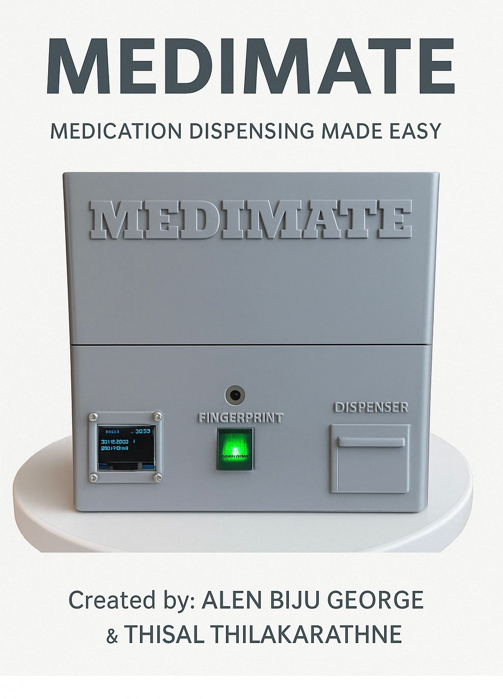
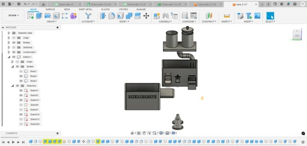
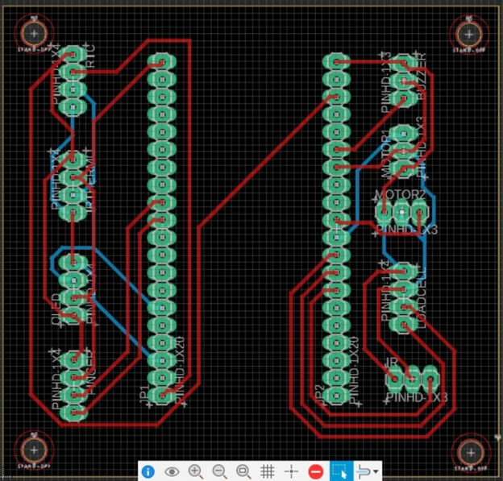
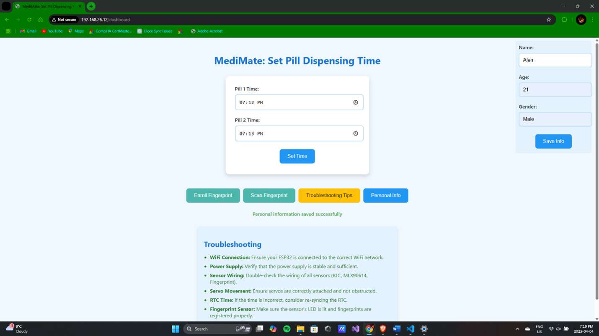

# MediMate: Smart Medication Assistant 💊
IoT-based smart medication dispenser using ESP32, sensors, and custom web dashboard.

MediMate is an IoT-powered smart medication dispensing system designed to assist individuals in taking their medications accurately and on time. This project combines embedded hardware, sensors, real-time monitoring, and a custom dashboard to create a secure, automated solution for medication management.

---

## 🔧 Technologies Used

- **Microcontroller:** ESP32
- **Sensors & Components:** 
  - Load Cell with HX711 Amplifier
  - DS3231 Real-Time Clock
  - MLX90614 Infrared Thermometer
  - OLED Display
  - Servo Motors
  - Fingerprint Sensor (for secure access)
- **Software & Tools:**
  - PlatformIO (VS Code)
  - C/C++ for firmware
  - HTML, CSS, JavaScript for dashboard
  - REST API + HTTP/MQTT protocols
  - Fusion 360 for 3D Enclosure Design
  - Git for version control

---

## 🌟 Features

- 🔐 **Secure Login System** (username + password)
- 📦 **Automated Pill Dispensing** with precise motor control
- 📊 **Real-Time Dashboard** to monitor:
  - Pill levels
  - Dispensing history with timestamps
  - Alerts for low pill stock
- 🌐 **IoT Connectivity** using HTTP/MQTT
- 📁 **Fully 3D-Printed Enclosure** with smart internal layout
- 🔍 **Optional Fingerprint Sensor** for advanced access control

---

>Here are some prototype and dashboard visuals from MediMate:

### 🖼️ Physical Prototype

### 💻 Dashboard UI

---

## 📁 Folder Structure

